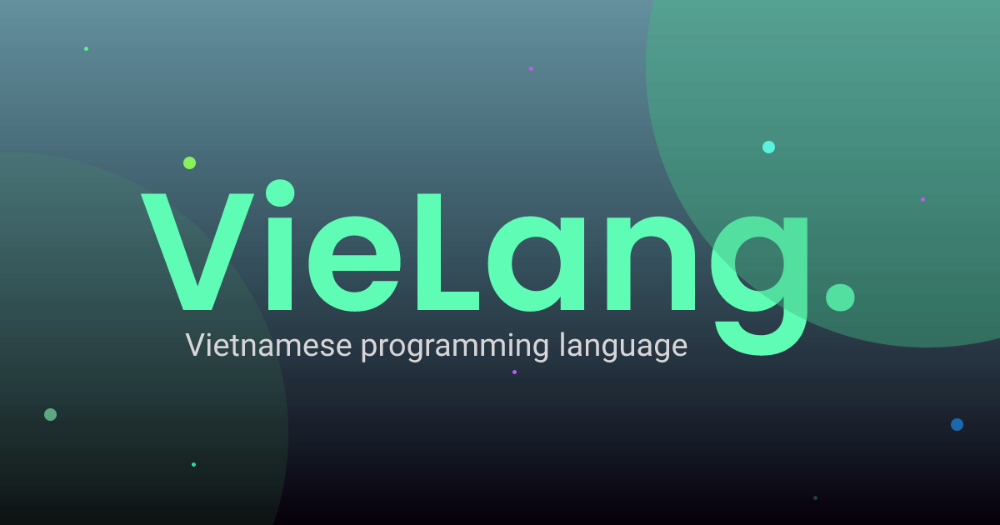

[](banner)

# Vielang - Vietnamese programing language

<p>
  <a href="./LICENSE"></a>
  <a href="https://vienhuynh.dev"></a>
</p>

Vielang là ngôn ngữ lập trình được xây dựng và biên dịch trên javascript. Vielang chấp nhận các cú pháp Tiếng Việt bao gồm ký tự dấu và dấu cách
Vielang là ngôn ngữ thông dịch, nó được chuyển đổi thành mã nguồn JavaScript và chạy trên trình duyệt.

Vielang hỗ trợ các tính năng bao gồm:
- Cú pháp Tiếng Việt, thân thiện với học sinh sinh viên Việt Nam
- Chấp nhận kí tự dấu và dấu cách
- ...[và xem thêm](https://vielang.vienhuynh.dev) 🚀

### Table of Contents

- 🚀 [Bắt đầu](#getting-started)
- 💻 [Cú pháp](#syntax)
- 📖 [Tài liệu](#documentation)
- 🔗 [Follow me](#follow-me)
- ⚖️ [License](#license)

---

## <a name="getting-started">🚀 Getting Started</a>

### Sử dụng ngay tại trình duyệt:

#### http://vielang.vienhuynh.dev

### Sử dụng package để tích hợp vào dự án cá nhân
```bash
npm i vielang
```

## <a name="syntax">💻 Hướng dẫn cú pháp</a>

Dễ dàng sử dụng bằng tiếng việt

Ví dụ:

```javascript
    khai báo tên = "Vien Huynh"; 
    tên = "Hoàng",

    khai báo hàm in tên(){
        trả về tên
    }
```

## <a name="documentation">📖 Tài liệu</a>

Bạn có thể xem thêm tài liệu tại [Vielang Documentation](https://vielang.vienhuynh.dev/docs). Tại đây có đầy đủ các thông tin về ngôn ngữ


## <a name="local-development">🏠 Local Development</a>

Follow the docs to [Set Up Your Local Development Environment](https://nuxt.com/docs/community/framework-contribution#setup) to contribute to the framework and documentation.

## <a name="follow-me">🔗 Follow me</a>
  - Website: https://vienhuynh.dev
  - Facebook: https://www.facebook.com/vienhoang133/
<p valign="center">
  
</p>

## <a name="license">⚖️ License</a>

[MIT](./LICENSE)
